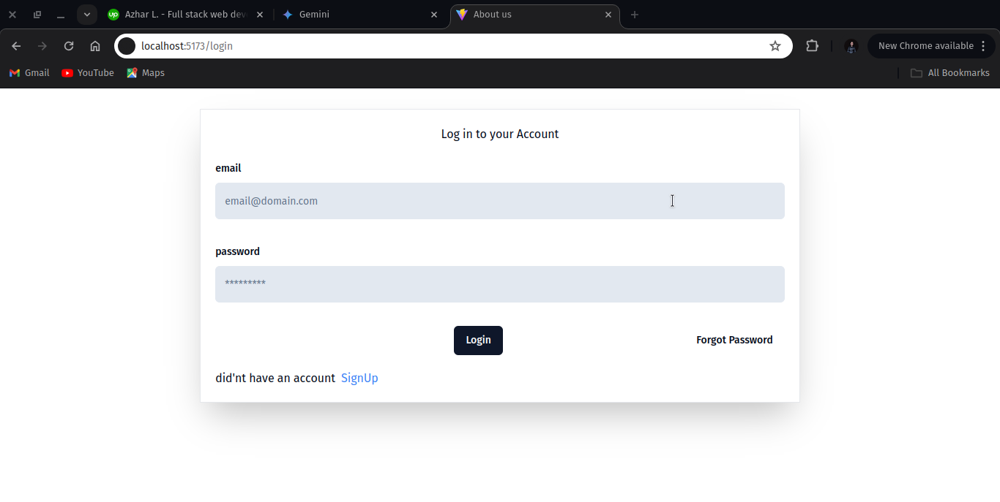
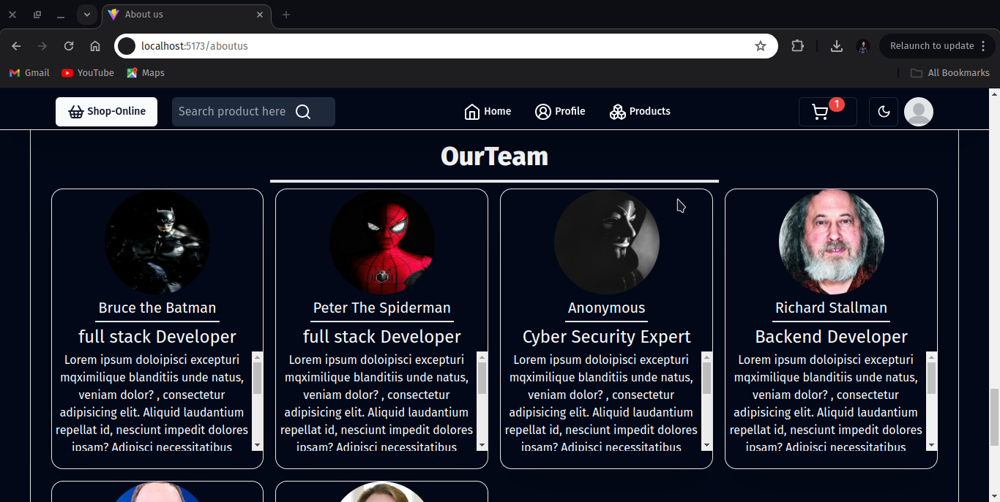
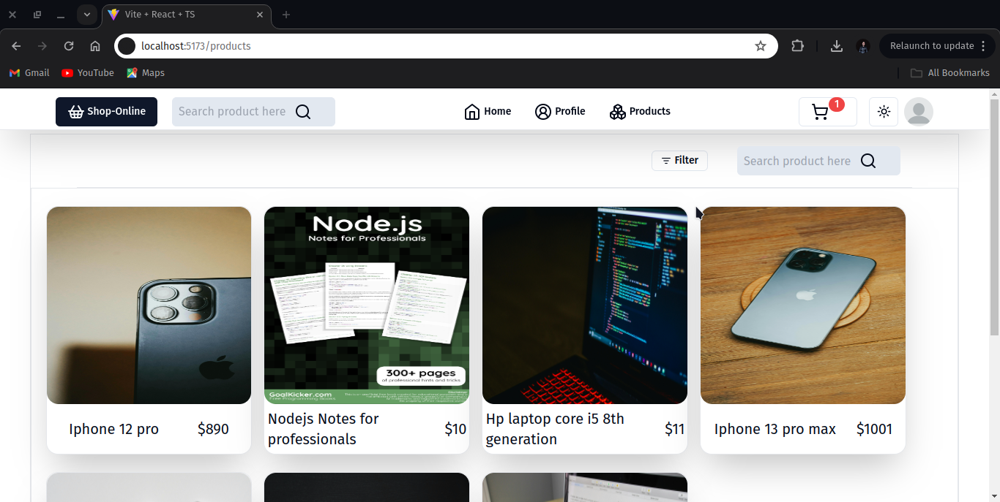

### [GitHub-Link](https://github.com/Azhar-lone/shop-online)

<!-- # [Live-Preview](https://) will be available after one commit -->
# shop-online
#### 1-this is full stack ecommerce website, it contain all the features that one should have. 
#### 2-fully secure and Performance Oriented Site with Authetication,Autherizetion And Validtions.
#### 3-Completely Responsive in All Sizes of Devices with Differenct Layouts for laptop/destop or larger screens ,Tablets or medium size screens and mobile or smaller screens.
.

# Core Technologies used :
### 1-React js
### 2-tailwind css 
### 3-Shadcn/ui 
### 4-express 
### 5-mongoose
### 6-typeScript

# Front-End (Core)
### 1-React js
### 2-tailwind css 
### 3-Shadcn/ui 
### 4-typeScript
### 5-react-router-dom
### 6-tiptap (RTE)
### 7-zod (for validations)
and more ...

# Back-End (Core)
### 1-express 
### 2-mongoose (ORM)
### 3-bcrypt (Hashing Passwords)
### 4-express-validator (for validations)
### 5-multer (for Uploading files)
### 6-nodemailer (for sending Mails)
### 7-redis (Temporarily dataBase)
### 8-jsonwebtoken aka jwt (for authentication)
and more ...

# Versions
#### updates which website will have with the passage of time and features it will contain on each version update
## features in version 1
### 1-Login
### 2-signup aka create Acount 
### 3-logout 
### 4-home page 
### 5-about us page
### 6-settings page
### 7-list All products
### 8-search product or users
### 9-add to cart and cart page
### 10-Forget password
### 11-products Detail page
### 12-profile Page
### 13-reviews
### 14-some admin funtionalities in frontEnd
### 14-admin can add blogs

## NOTE:
### 1-Backend is almost ready completely 
### 2-frontEnd is still on version 1

##### 3-Lot more features in version 1, but some of these features are not
##### completed 100%, as it is the part of development.
##### we impliment features and make them more better with,
##### the passage of time ,and requirements .

## features in version 2
### 1-upload product  
### 2-edit product
### 3-delete your product
### 4-profile page
### 5-edit profile
### 6-
### 7-add filters in all products page
### 8-add chat with seller option
### 9-crud review

## features in version 3 
## All admin features
### 1-admin home page
### 2-get all users list and get all products list
### 3-edit about us page home etc 
### 4-show website usage and stats in graph
### 5-Add other admins

# Screen Shots of Latest Version (version 1)

## login LighMode

### 2-Aboutus page OurTeam Section in DarkMode

### 3-products page in LightMode
